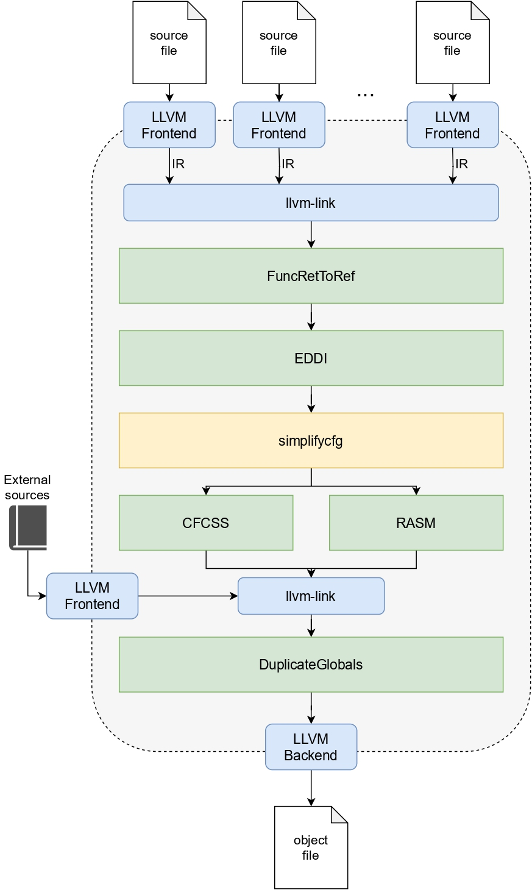

# ASPIS: Automatic Software-based Protection to Improve Safety

ASPIS (from the ancient greek Ἀσπίς (Aspís),*shield*) is a out-of-tree plugin for LLVM that acts on the Intermediate-Representation (IR) in order to harden the code against Single-Event Upsets (SEUs). 

The hardening process is done by the sequence of passes depicted in the following figure:
<p align=center>

</p>

> [!NOTE] \
> **No pre-built pipeline is currently available**: follow the instructions in the next sections in order to setup the pipeline manually.

## Pre-requisites

The toolchain has been tested with the following versions:
- CMake 3.22.1
- CLang 15.0.0

## Building

To build ASPIS, type the following commands:

```bash
mkdir build
cmake -B build -DLLVM_DIR=<your/llvm/dir>
cmake --build build
```

Where `your/llvm/dir` is the directory where LLVMConfig.cmake is found (check here [here](https://llvm.org/docs/CMake.html) for further information).

# Usage
> [!WARNING] \
> **Only the old pass manager is currently supported**: the support for the new pass manager and the newest versions of LLVM (>15.0.0) is currently under developement.

The compiled passes can be found as shared object files (`.so`) into the `build/passes` directory, and are described in the following. In order to apply the optimization, you must use LLVM  `opt` loading the respective shared object file.

### Data protection
Developers can select one of the following passes for data protection using the `-eddi_verify` flag:

- `libEDDI.so` with the `-eddi_verify` flag is the implementation of EDDI in LLVM;
- `libFDSC.so` with the `-eddi_verify` flag is the implementation of Full Duplication with Selective Checking, an extension of EDDI in which consistency checks are only inserted at basic blocks having multiple predecessors.
- `libSEDDI.so` with the `-eddi_verify` flag is the implementeation of selective-EDDI (sEDDI), an extension of EDDI in which consistency checks are inserted only at `branch` and `call` instructions (no `store`).

Before and after the application of the `-eddi_verify` passes, developers must apply the `-func_ret_to_ref` and the `-duplicate_globals` passes, respectively.

### Control-Flow Checking
These are the alternative passes for control-flow checking:
- `libCFCSS.so` with the `-cfcss_verify` is the implementation of CFCSS in LLVM;
- `libRASM.so` with the `-rasm_verify` is the implementation of RASM in LLVM;
- `libINTER_RASM` with the `-rasm_verify` is the implementation of RASM that achieves inter-function CFC.

## Example of compilation with ASPIS (sEDDI + RASM)
First, compile the codebase with the appropriate front-end (currently, only `clang` 15.0.0 has been tested).

```bash
clang <files.c> -emit-llvm -S
```

The output files are IR files having an `.ll` extension. It is required to link them using `llvm-link` as follows:

```bash
llvm-link -S *.ll -o out.ll
```

Now, `out.ll` is a huge `.ll` file containing all the IR of the code passed through the clang frontend. The `out.ll` file is then transformed by our passes in the following order:

- FuncRetToRef
- sEDDI
- RASM
- DuplicateGlobals

With the addition of some built-in LLVM passes (`lowerswitch` and `simplifycfg`).

Run the following:

```bash
opt -lowerswitch out.ll -o out.ll
opt --enable-new-pm=0 -S -load </path/to/ASPIS/>build/passes/libEDDI.so -func_ret_to_ref out.ll -o out.ll
opt --enable-new-pm=0 -S -load </path/to/ASPIS/>build/passes/libSEDDI.so -eddi_verify out.ll -o out.ll
opt -passes=simplifycfg out.ll -o out.ll
opt --enable-new-pm=0 -S -load </path/to/ASPIS/>build/passes/libRASM.so -rasm_verify out.ll -o out.ll
```
You may also want to include other files in the compilation, that are previously excluded because of some architecture-dependent features. This is done with the following commands, which first remove the previously emitted single `.ll` files, then compiles the excluded code and links it with the hardened code:

```bash
mv out.ll out.ll.bak
rm *.ll
clang <excluded_files.c> -emit-llvm -S
llvm-link -S *.ll out.ll.bak -o out.ll
```

Then, apply the last pass and emit the executable: 

```bash
opt --enable-new-pm=0 -S -load </path/to/ASPIS/>build/passes/libEDDI.so -duplicate_globals out.ll -o out.ll
clang out.ll -o out.elf
```
