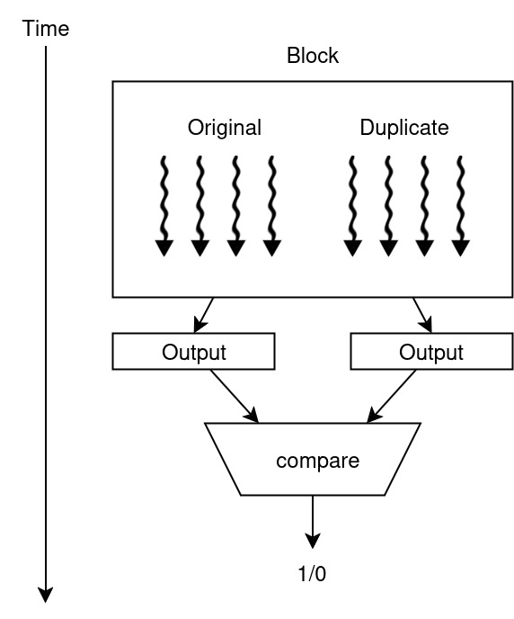
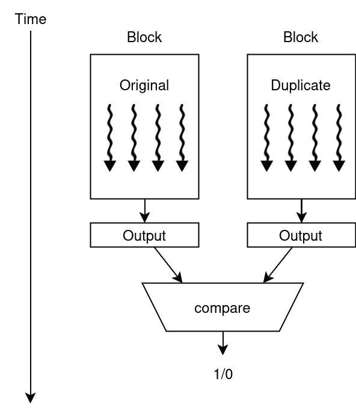
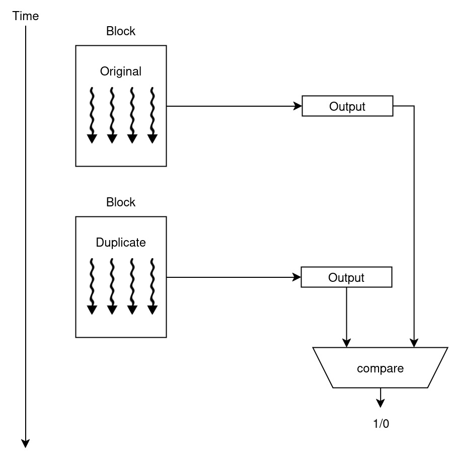

# CUSPIS - CUDA Software-based Protection and Integrity Suite

CUSPIS is an header-only library part of ASPIS for protecting CUDA code. 

## Features
CUSPIS provides a set of APIs wrapping CUDA functions for execution *duplication* and *triplication*:

- cuspisMalloc
- cuspisFree
- cuspisMemcpyToHost
- cuspisMemcpyToDevice
- Kernel construction and launch function

## Redundancy policies

How the duplication or triplication allocates the computation on the GPU depends on the redundancy policy. In particular, CUSPIS provides three redundancy policies: redundant threads, blocks, or kernel.

### Redundant threads
The redundancy affects the number of threads allocated by the kernel.

### Redundant blocks
The redundancy affects the number of blocks allocated by the kernel.

### Redundant kernel
The redundancy affects the number of times in which the kernel is executed.

## Usage
You can use CUSPIS APIs by importing the header `CUSPIS.h`. 

The number of replicas is defined with the variable `NUM_REPLICAS`. Two replicas perform just fault detection, three replica perform fault detection and correction.

When creating a CUSPIS kernel, you can choose between the three aforementioned redundancy policies of CUSPIS:
- `cuspisRedundantThreads`: use NUM_REPLICAS times the number of threads.
- `cuspisRedundantBlocks`: use NUM_REPLICAS times the number of blocks.
- `cuspisRedundantKernel`: execute the kernel NUM_REPLICAS times.

## Examples
Some examples of the usage of the library can be seen in the `examples/cuda` library. Compile CUSPIS examples using the `compile_cuda.sh` script. You can change the example to modify changing the `inputfile` variable. You may also need to change the `libcuda` directory to match your installation path.

After compiling, you have an executable `./out` file that you can use to run CUSPIS.